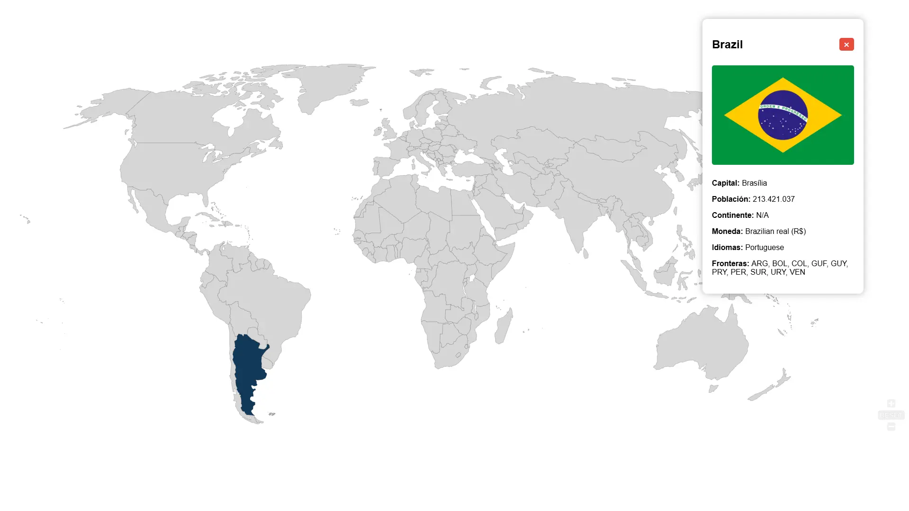

# 🌍 Interactive World Map

An interactive world map built with **HTML**, **CSS**, and **JavaScript** that allows users to explore countries by simply clicking on them.

Each selected country displays useful information fetched in real time from the **REST Countries API**.

## Features

- Interactive SVG world map
- Click on any country to display information
- Country name
- Capital city
- Population
- Continent
- Currency
- Languages
- Border countries
- National flag
- Zoom and pan support
- Smooth card animations

## Built With

- HTML5
- CSS3
- JavaScript (ES6+)
- REST Countries API v5
- Anime.js
- svg-pan-zoom

## 📷 Preview



## Live Demo

https://thomas-centurion.github.io/interactive-map/

## Installation

Clone the repository:

```bash
git clone https://github.com/thomas-centurion/interactive-map.git
```

Open the project folder and run it using Live Server or any local web server.

## API

This project uses the **REST Countries API v5**, which requires an API key.

Create your own key at:

https://restcountries.com/

Then replace:

```js
const API_KEY = "YOUR_API_KEY";
```

with your personal API key.

## License

This project was created for learning purposes and is part of my web development portfolio.
